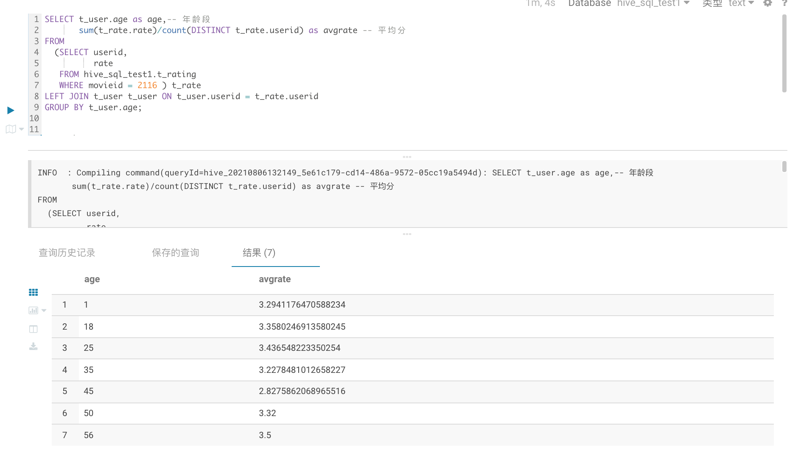
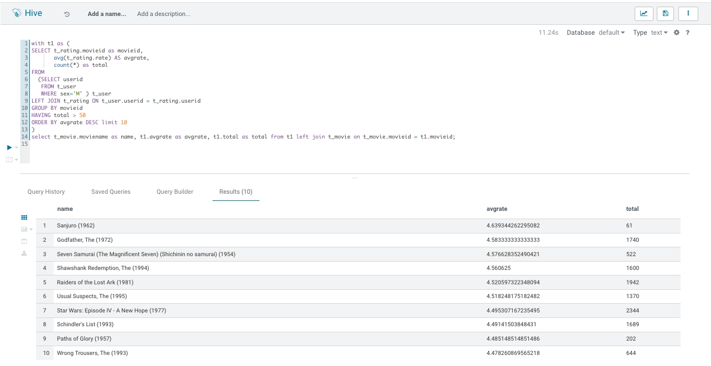
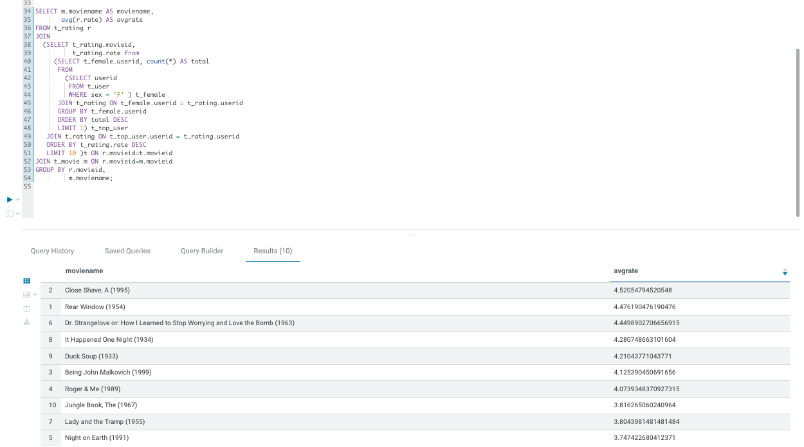

**ps: SQL题目运行环境没有使用极客提供的环境**

## 题目1

```SQL
SELECT t_user.age,-- 年龄段
       sum(t_rate.rate)/count(DISTINCT t_rate.userid) -- 平均分
FROM
  (SELECT userid,
          rate
   FROM hive_sql_test1.t_rating
   WHERE movieid = 2116 ) t_rate
LEFT JOIN t_user t_user ON t_user.userid = t_rate.userid
GROUP BY t_user.age
```



## 题目2
```SQL
with t1 as (
SELECT t_rating.movieid as movieid,
       avg(t_rating.rate) AS avgrate,
       count(*) as total
FROM
  (SELECT userid
   FROM t_user
   WHERE sex='M' ) t_user
LEFT JOIN t_rating ON t_user.userid = t_rating.userid
GROUP BY movieid
HAVING total > 50
ORDER BY avgrate DESC limit 10
)
select t_movie.moviename as name, t1.avgrate as avgrate, t1.total as total from t1 left join t_movie on t_movie.movieid = t1.movieid;
```




## 题目3

```SQL
SELECT m.moviename AS moviename,
       avg(r.rate) AS avgrate
FROM t_rating r
JOIN
  (SELECT t_rating.movieid,
          t_rating.rate from
     (SELECT t_female.userid, count(*) AS total
      FROM
        (SELECT userid
         FROM t_user
         WHERE sex = 'F' ) t_female
      JOIN t_rating ON t_female.userid = t_rating.userid
      GROUP BY t_female.userid
      ORDER BY total DESC
      LIMIT 1) t_top_user
   JOIN t_rating ON t_top_user.userid = t_rating.userid
   ORDER BY t_rating.rate DESC
   LIMIT 10 )t ON r.movieid=t.movieid
JOIN t_movie m ON r.movieid=m.movieid
GROUP BY r.movieid,
         m.moviename;
```

